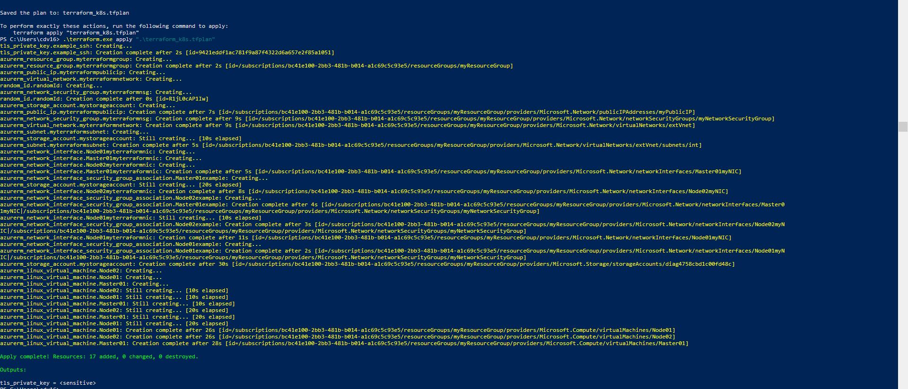

# DXXR
Devops test -
## Author :
Christian Daniel Valls 
### contact
cdv1986@gmail.com    
https://www.linkedin.com/in/christianvalls/

# TEST:
Description

You’d need to prepare a simple service which uses a storage dependency(Redis/MySQL/etc.)
written in your language of choice, prepare a Dockerfile and a Helm chart for it and deploy it to a
Kubernetes cluster provisioned by yourself.
Requirements
● You can use any Kubernetes provider/deployment way you’d like
● All the other Helm charts used in the deployment should be listed
● The resulting deployment files must have the ability to be deployed in a few(ideally one)
commands
● All the development history should be recorded in Git
● The resulting Git repository should have a README with enough information to do a full
deployment from scratch
Bonus points
● Terraform files to provision a K8s cluster on the cloud
● Ruby or Golang solution for bumping application version
Deliverables
● Deployment platform Git repository tarball/zip with README included
● [Optional] Screen recording of the whole deployment and teardown process
# Resolution:

### BEST WAY DIAGRAM PROD:
External etcd topology

https://kubernetes.io/docs/setup/production-environment/tools/kubeadm/ha-topology/

### IMPLEMENTED SOLUTION ON DEVELOPER MACHINE(low hardware specs no HA):

https://kubernetes.io/docs/setup/production-environment/tools/kubeadm/ha-topology/

### Then migrated to AZURE.
### RUN Terraform.
PS C:\Users\cdv16> az login
PS C:\Users\cdv16> terraform.exe init

PS C:\Users\cdv16> /terraform.exe plan -out terraform_azure.tfplan
PS C:\Users\cdv16> .\terraform.exe apply "terraform_k8s.tfplan"
### VIDEO LOG FROM TERRAFORM

### RUNNING CLUSTER IP A

#### CONFIG:
#### MASTER01
1 MASTER (TWO ROLES ETCD) (address_space= ["10.0.0.0/16"])
HOSTNAME:(MASTER01)

#### MASTER02
1 MASTER (ROLES CONTROLPLANE) (address_space= ["10.0.0.0/16"])
HOSTNAME:(MASTER02)

##### Run on server for prepare pre install 
[root@localhost scripts]# chmod a+x prepare.sh
[root@localhost scripts]# sh prepare.sh

#### WORKER01
 WORKER (address_prefixes=["10.0.1.0/24"])
 Hostname:(WORKER01)
##### Run on server for prepare pre install 
[root@localhost scripts]# chmod a+x prepare.sh
[root@localhost scripts]# sh prepare.sh

#### install RKE ON MASTER 01
rke up -config  /home/azureuser/scripts/cluster.yml

#### TO CREATE THE CLUSTER WITH RKE
sudo  rke up -config  /home/azureuser/scripts/cluster.yml

## Author :
Christian Daniel Valls 
### contact
cdv1986@gmail.com    
https://www.linkedin.com/in/christianvalls/
