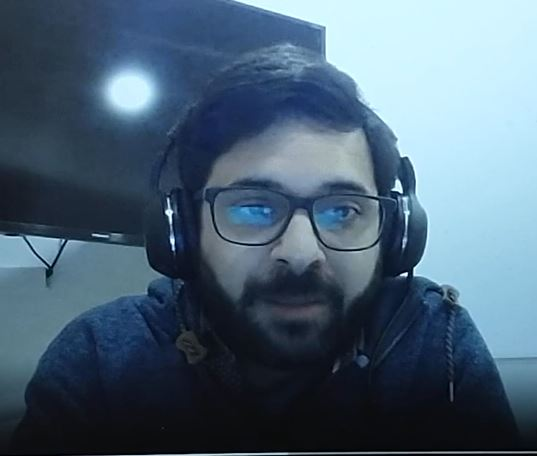

# Resume: Christian daniel valls
Contractor DevOps Architect // SRE // TeamLeader // PM
## Author :
Christian Daniel Valls 
### contact
- cdv1986@gmail.com    
- https://www.linkedin.com/in/christianvalls/
- Work number: +5491164676677

## Skills: 
DevOps/ SRE / Leadership / Scrum Master - Agile Coach/ PM / Clouds / Sales / Purchasing / Regulatory compliance information security/ Process improvements / Ethical Hacking /.

## Summary:
Experienced in Information Technology Infrastructure with 20 years on IT  history of working in the services' industry, financial Services Industry and Armed Forces. As a DevOps Team Leader, Skilled in: Management and team leadership, communication company goals, safety practices, and project management. Cloud Computing, Containers, k8s,  CI/ CD on Jenkins Pipelines as code, ETL Pipelines,  Linux servers, Automation, Code reviewing, Bash Scripting, Secure testing, network administration, Technical Support, Database Security, and Oracle Database Administration. Monitoring system implementation, automated routines scripting and SOC operations.

## Goals:
- Improve communication between areas, team productivity. 
- improve the delivery time and deliver software with quality Assurance.
- Design pipelines as code compliant with the software life cycle of apps, Enforcing best practices and methodologies.
- Keep platforms operational. Make technical and operational improvements in areas.
- Ensure the safety of the company. 
- Ensure a logical and optimized usage of the cloud platforms (cost and performance oriented).

## More skills:
-Jenkins 
-Pipelines as code (CI/CD) -Automated ETL Workflows -Kubernetes, OpenShift 
-Cloud:   AWS, Azure, Google Cloud, OpenStack
-Containers: Docker, kaniko 
-Ansible, Terraform, Ansible, Nexus, Artifactory Git -Methodologies: Agile, Scrum. 
-Web Services: Apache , IIS , Nginx , LAMP 
-Remote Access Services: OpenSSH, RDS. 
-Windows Services: Active Directory, DNS, DHCP, RDS, WSUS, Microsoft Cluster Services. 
-Messaging Services: PostFix, Exchange 2003/2007, MDAEMON. -Security: ISA Server, Fortinet Firewall, Symantec EndPoint, Kaspersky EndPoint,  Squid, Squid Guard, Ntop. 
-Backup Tools ARCserve Backup, Shell Scripting, BackupExec. -Hypervisors: VMware ESX/VSphere, VCenter, Hyper V, Oracle VirtualBox. 
-Deploy and Provisioning Tools: HP RDP, WDS, HP Intelligent Provisioning. 
-Languages: Command Batch, PowerShell, Shell Bash, GO, Python, Maven. 
-Monitoring Tools: Nagios, Ntop , Cloud Control, VCenter, ELK. -Console: HP iLO, HP Onboard Administrator, Dell IDRAC. -Network: Cisco, HP  3COM, Fortinet. 
-OS Server: Windows Server, Oracle Linux Ubuntu, Red Hat, CentOS, MacOs 
-Mobile: Andriod, IOS

# Experience:

## DevOps Architect:
### Working as DevOps architect on BBVA international bank.

BBVA Contract
Dates EmployedJul 2020 – August 2021
Employment Duration1 yr 2 mos
LocationBuenos Aires Province, Argentina
• Defining and applying CI/CD standards alongside Global DevOps BBVA team for Argentinian Branch. Working with Agile squads to adopt new tools and ways of working.
• Serve as DevOps automation architect to analyze, design, and implement strategies for CI/CD pipeline(s) while ensuring high availability on production and pre-production services.
• Build and maintain a resilient, secure, and efficient SaaS application platform to meet established SLAs.
• Scale infrastructure to meet rapidly increasing demand.
• Work and strive in providing an extremely reliable environment that is fully automated and free from obstacles.
• Manage cross-functional requirements working with Engineering, Devs, QA and other departments.
• Develop and Improve operational practices and procedures.
• Provide documentation for the implementations for other teams.
• Triage escalated issues, and document RCAs, escalating to developers wherever necessary.
• Implement Devops best practices on all aspects of reliability, scalability and high availability.
• Facilitate engineering team with deployment infrastructure and monitoring / alerting
• Enforcement: gitfllow, coverage, and best practices for pipelines as code.

Technologies: Jenkins, Groovy pipelines, ETL pipelines, SonarQube, Artifactory, AWS, GCP, Kubernetes, EKS, Datadog, Bitbucket, Ansible, Terraform, Jira.

Achievements:
-Migrate the biggest monoline app to the new CI/CD architecture.
-Migrate Microservice oriented apps to cloud or on site datacenters.
-Generating documentation for other teams.
- Analyze the company apps and the CI /CD Life cycle time and cost to improve the way to made things and accomplish regulations for the central bank from Argentina.
-Create the local pipeline for Argentina and administrate the Jenkins cluster.

## DevOps Engineer Team Lead & Pre-sale Engineer:
AW Software S.R.L. Full-time
Dates Employed Jan 2020 – August 2021
Employment Duration1 yr 8 mos
LocationCity of Buenos Aires, Argentina
Responsibilities:
-AWS (administration / Deployment).
-KUBERNETES (orchestration & implementation)
-Docker
-Infrastructure as code (IaC)
-Atlassian Suite
-Hybrid Cloud Implementation
-Technology Research
-AWS Cost Optimization.
-Maven and Jenkins CI/CD.
Cucumber Testing
-JaCoCO ( Java Coverage)
-Scripting on Terraform, Ansible, Jenkins.
-GIT / Bitbucket
-Go Lang Programming.
-System Administrator (WINDOWS / LINUX).
-Network Administration (CISCO / HP / LINUX).
-Security (Squid squid-guard HTTPS / Nginx).
-Web Servers (Apache Nginx).
-PF-SENSE / OPENVPN.
-Monitoring system for critical services.
-Bash Scripting (So Routines, CRUD users and Permissions, Service control, etc.).
-Backup And recovery (Scripting and automation).
-VMware ESXi Administration

Achievements:
-Implementation Google Auth on platform.
-Found people for my DevOps team by my own.
-Creation of the training area and path career for DevOps Team and Developers in conjunction with the CEO of the company.
-Securitization of the corporate site (implementation of https) for all the public and services.
-Generate the space to have weekly meetings with the entire company in conjunction with the company's CEO
-perform a technical paper researching vault technologies for a multi-bank implementation.

## SRE:
Argentine Federal Police
Dec 2013 – Jul 2021
Employment Duration 7 yrs 8 mos
Location Ciudad Autonoma De Buenos Aires
Responsibilities:
-Infrastructure implementation (Virtual, Container or physically )
-Ansible , GIT , Jenkins, Docker
-System Administrator (WINDOWS / LINUX)
-Network Administration (CISCO / HP / LINUX)
-Security (Squid squid-guard HTTPS )
-Web Servers (Apache Ngix IIS)
-PF-SENSE
-Monitoring system for cricital services (Nagios)
-Bash Scripting (So Routines, CRUD users and Permissions, Service control, etc.)
Backup And recovery (Scripting and automation)

Accomplishment:
-Implementation of Monitoring Systems for critical services or applications: analize all the logical faults points, Services, Applications and Networking components.
-Creation and implementation:
-AD Server, GPO for security,
- Nginx Squid, Squid Guard, PF-SENSE, Reverse Proxy, HTTPS implementation.
-Security Policy appliances
-AWS implementation
-Docker on bare metal implementations.
-Ntop implementation for visibility.

## SQL Developer:
Argentine Federal Police
Jan 2013 – Dec 2013
Employment Duration 12 mos
SQL / PL SQL scripting , Automation. Information migration, DATA Normalization
Application support.

## DevOps Engineer:
Semperti Full-time
Dates EmployedApr 2019 – Jun 2019
LocationBuenos Aires, Buenos Aires Province, Argentina
Member of DevOps team to design, write document and deliver software
to improve product availability, scalability and performance. Automate the
installation and upkeep of build and deploy tools and dependencies
Evaluate current build, release and hosting infrastructure and implement
enhancements as required defined processes, techniques, architectures
and practices ensuring the monitoring, reliability and performance of
company products and services Support and administration: AWS,
Docker, Kubernetes, Ansible, Jenkins, Redhat Openshift,
Terraform, Jira,, ELK, Ansible
working as agile team member.

## IT Support:
Company NameYara (Ecosistemas)
Dates EmployedSep 2012 – Feb 2013
Employment Duration6 mos
Responsibilities:
-Technical support
-Active directory Management
-Hardware Repair

## System Administrator: Windows / Linux

System Administrator
Company Name Grupo Pujol Figueras
Dates EmployedJan 2008 – Feb 2012
Employment Duration4 yrs 2 mos
Local and remote:
-Network and Servers Administration
-Unix Administration
-Windows Server Administration
-Networking
-Mcafee EPO Administration and Deployment
-Backup Management and Coordination
-HP support partner ( Servers Hardware Support Services)

Accomplishment:
-After passing through the support sector, Go to Server and operating system support.

## Help Desk Technician
Company Name CEITECH
Dates Employed 2007 – 2008
Employment Duration 1 yr
-Technical support to Arnet ISP
Accomplishment:
Succes at improving internal communication of the calls reception work team, and so results improved as well.

# Resume: Christian daniel valls
Contractor DevOps Architect // SRE // TeamLeader // PM
## Author :
Christian Daniel Valls 
### contact
- cdv1986@gmail.com    
- https://www.linkedin.com/in/christianvalls/
- Work number: +5491164676677

