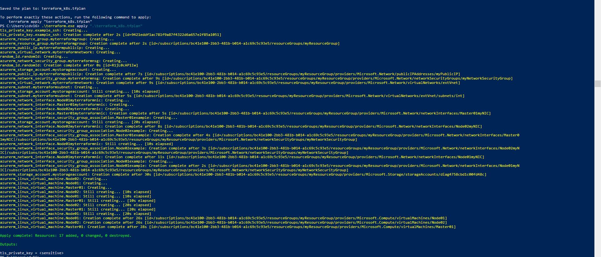

# Amsterdam
Devops test -
## Author :
Christian Daniel Valls 
### contact
cdv1986@gmail.com    
https://www.linkedin.com/in/christianvalls/

# Actual Scenario:

actualScenario01.jpg

# Phase 1:

### IMPLEMENTED SOLUTION ON DEVELOPER MACHINE(low hardware specs no HA):

https://kubernetes.io/docs/setup/production-environment/tools/kubeadm/ha-topology/

### Then migrated to AZURE.
### RUN Terraform.
PS C:\Users\cdv16> az login
PS C:\Users\cdv16> terraform.exe init

PS C:\Users\cdv16> /terraform.exe plan -out terraform_azure.tfplan
PS C:\Users\cdv16> .\terraform.exe apply "terraform_k8s.tfplan"
### VIDEO LOG FROM TERRAFORM

### RUNNING CLUSTER IP A

#### CONFIG:
#### MASTER01
1 MASTER (TWO ROLES ETCD) (address_space= ["10.0.0.0/16"])
HOSTNAME:(MASTER01)

#### MASTER02
1 MASTER (ROLES CONTROLPLANE) (address_space= ["10.0.0.0/16"])
HOSTNAME:(MASTER02)

##### Run on server for prepare pre install 
[root@localhost scripts]# chmod a+x prepare.sh
[root@localhost scripts]# sh prepare.sh

#### WORKER01
 WORKER (address_prefixes=["10.0.1.0/24"])
 Hostname:(WORKER01)
##### Run on server for prepare pre install 
[root@localhost scripts]# chmod a+x prepare.sh
[root@localhost scripts]# sh prepare.sh

#### install RKE ON MASTER 01
rke up -config  /home/azureuser/scripts/cluster.yml

#### TO CREATE THE CLUSTER WITH RKE
sudo  rke up -config  /home/azureuser/scripts/cluster.yml

#### AFTER ALL THE CLUSTER CONFIGURATION WE ARE GOING TO USE:
PODS:
- NGINX REVERSE PROXY TO REDIRECT ALL TO HTTPS -----> INTERNAL SUBNET TO 443 OAUTH PROXY
- OAUTH2-PROXY ------->TOKEN WELL WORKING -> WEB SERVER INTERNAL SUBNET
- WEB SERVER RUNING ON HTTPS ON INTERNAL SUBNET
- DATABASE 
- STORAGE AS SERVICE FOR THE FILE SERVER AMAZON S3 OR AZURE BLOB SOTRAGE SERVICE 

# Phase 2:
USE THIS TOPOLOGY WITH MULTIPLE ZONES ON MULTI CLOUD PROVIDERS AND DNS BALANCERS ZONES AND HA MANAGEMENT AND AUTO SCALING 
### BEST WAY DIAGRAM PROD:
External etcd topology
https://kubernetes.io/docs/setup/production-environment/tools/kubeadm/ha-topology/

# Pashe 3
- Prevent DDOS ATACKS
- HAVE SEPARATED ADMINISTRATION ROLES
- USE BEST PRACTICES FOR THE DEFINITIONS
- MAKE SECURE CONNECTIONS
- HAVE REVESE PROXYS
- USE INFRASTRUCTURE AS SERVICE
- BE ALWAYS UPDATED. 
-NEVER USE AN EXPOSED WEB SERVER WITH DATABASE, FILE SERVER AND WEBSERVER ROLES IN THE SAME BARE METAL MACHINNE.

## Author :
Christian Daniel Valls 
### contact
cdv1986@gmail.com    
https://www.linkedin.com/in/christianvalls/
